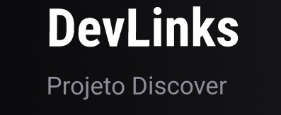
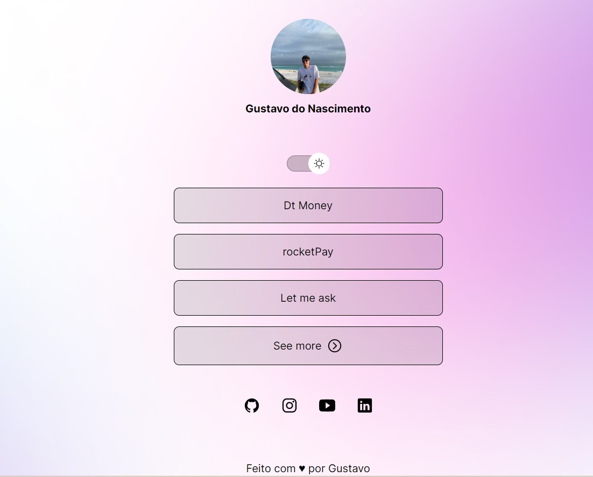
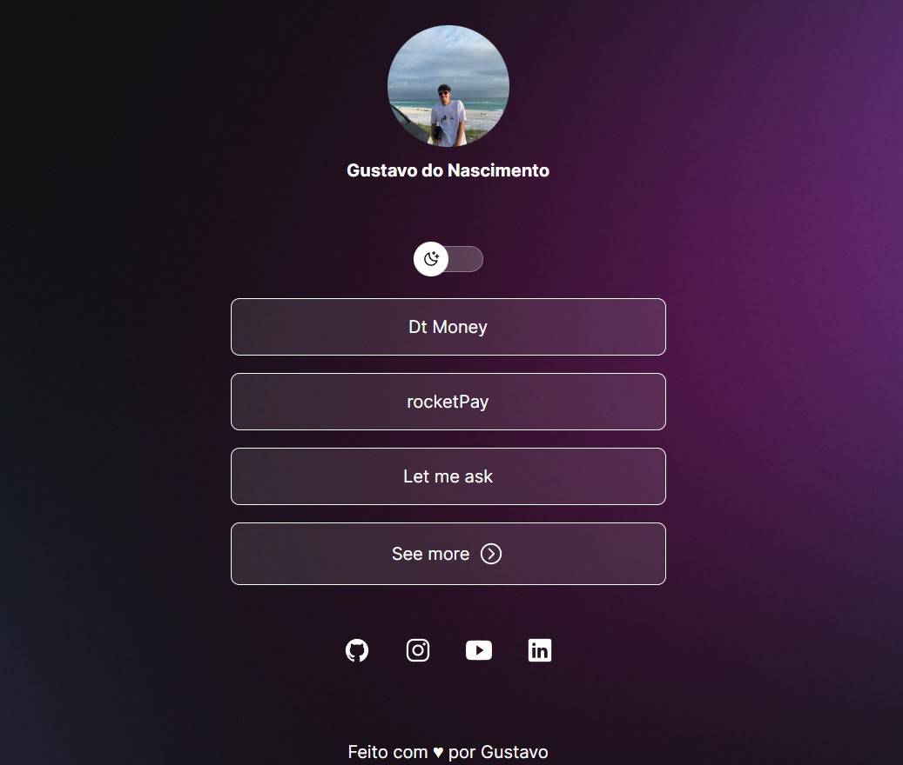

<div align="center">
  
  <h2></br>Site onde você pode mostrar todo seu portifólio</h2>
</div>

## Tecnologias utilizadas

- HTML
- CSS
- JavaScript
- Figma

## Projeto

Você pode baixar o projeto em formato ZIP.

### Clonar Projeto

```bash
$ git clone https://github.com/ngustavo80/Devlinks.git
```

## Imagens

<div align="center">
  
  
</div>
